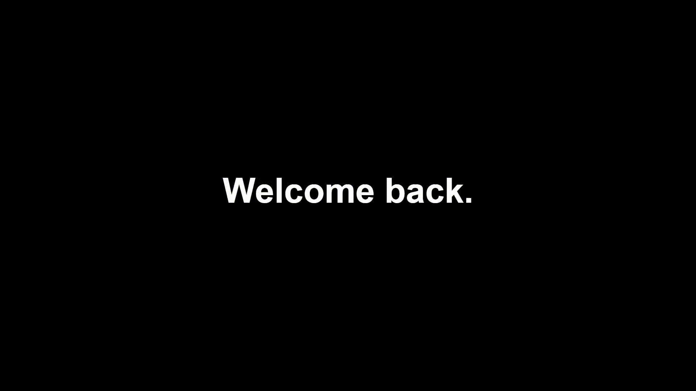

# as-bump-maker (Lawgics fork)
Custom Adult Swim-style bump maker for Plex pre-rolls and server announcements.
Fork of [Matthunker/as-bump-maker](https://github.com/Matthunker/as-bump-maker) with full source in `web/`.
## Demo

## Original features
- Text card timeline (text + duration)
- Per-card text placement (presets + drag-to-place)
- Optional background image/video (cover/contain + dim)
- Optional music upload (muxed into export)
## Planned features (this fork)
- Per-card images (text, image, or both)
- Export to server folder (preroll path)
- Optional basic auth
## Run from source (development)
    cd web
    python3 -m http.server 8080
Then open http://localhost:8080 in your browser.
## Run upstream Docker image
    docker run --rm -p 5173:80 matthuey/as-bump-maker:latest
Then open http://localhost:5173 in your browser.
## Notes
- MP4 export is done in-browser (MediaRecorder when supported; otherwise WebM to MP4 via ffmpeg.wasm).
- First export may download browser-side encoder assets depending on your setup.
