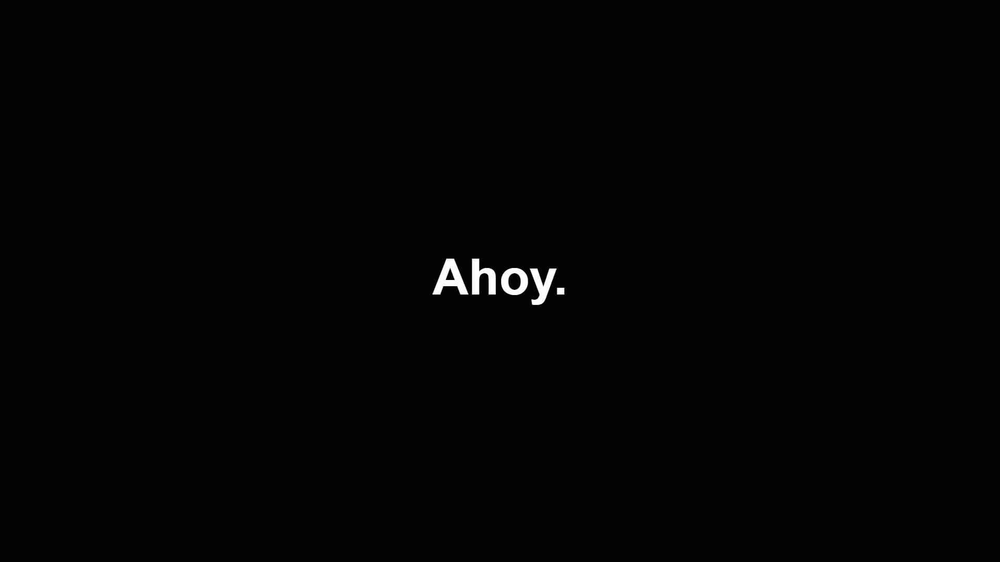

# [ahoy] — ahoy-bump-maker

**Short announcement videos for Plex server admins.**

## Why this exists

Self-hosted Plex admins often struggle to reach everyone on the server:

- **Group texts** expose phone numbers and are easy to mute
- **Discord** only works if every viewer actually uses it
- **Email** gets ignored or lost

Your users already open Plex to watch something. **[ahoy]** lets you meet them there — create simple Adult Swim–style bump videos for maintenance windows, new features, library updates, and anything else that's awkward to broadcast elsewhere. Export an MP4 and deliver it on Plex as a **pre-roll** or (coming soon) a pinned **home screen** collection.

## See it in action

### Example output



### Demo

_App walkthrough (screen recording) coming soon._

## What you can do

[ahoy] is a small browser app — no video editor to learn. You build a short announcement slide-by-slide, preview it, and download an MP4 for Plex.

- **Create a multi-part announcement** — Add cards (like slides). Each card shows for a few seconds, one after another — perfect for "hey everyone" → the news → a sign-off.
- **Use text, images, or both** — Type your message, upload a logo or photo, or combine them on the same card (e.g. your avatar + "your server admin").
- **Control timing** — Set how long each card stays on screen. Not sure? Click the **Suggested** time under Seconds and it picks a readable length based on the card's word and character count.
- **Style text per card** — Set a default font under **Text style**, then override font or size on individual cards (e.g. a quiet `[ahoy]` whisper on the last card).
- **Position everything visually** — Click a card, then drag text and images in the preview until the layout looks right. No coordinate math.
- **Add atmosphere (optional)** — Background image or video (with mute/loop controls), light grain, quick fades, background music — or skip all of it and keep the classic black bump look.
- **Choose output size** — **Output** sets resolution and FPS; font size scales automatically when you change resolution.
- **Preview the full video** — Hit **Preview** to watch the whole announcement; a progress bar shows how far you are.
- **Export an MP4** — One click downloads a file you can drop into Plex pre-rolls, NeXroll, or a media folder. After export you can play the result in the app, then go back to editing.
- **Pick up where you left off** — Your work saves automatically in the browser while you edit.
- **Save templates** — Use **Templates** in the top bar to save a reusable deck (greeting, logo, sign-off, music, and more), load it for the next announcement, or export/import a backup file.
- **Preview uploads** — Play audio and check background files in the editor before you export.

## Get started

Everything runs in your **web browser**. You edit on your PC; the finished MP4 goes on your Plex server. No install wizard — just open the app, make your bump, export, done.

### Docker (recommended for homelab)

Paste into **Dockhand**, **Dockge**, Portainer, or any Compose host:

```yaml
services:
  ahoy:
    image: ghcr.io/lawgics/ahoy-bump-maker:latest
    container_name: ahoy
    ports:
      - "1234:80"
    restart: unless-stopped
```

Or from a git clone:

```bash
git clone https://github.com/Lawgics/ahoy-bump-maker.git
cd ahoy-bump-maker
docker compose up -d
```

Open **http://localhost:1234** (or `http://<your-server-ip>:1234`).

**Updates:** pull the latest image and recreate the container:

```bash
docker compose pull
docker compose up -d
```

### Run from source (optional)

**Option A — Download**

1. Open this repo on GitHub → green **Code** button → **Download ZIP**
2. Unzip it somewhere simple, e.g. `C:\Users\You\ahoy-bump-maker`
3. Inside that folder, open the **`web`** folder — that's the app

**Option B — Git**

```bash
git clone https://github.com/Lawgics/ahoy-bump-maker.git
cd ahoy-bump-maker/web
```

**Start a local server** in the **`web`** folder:

Windows (PowerShell):

```powershell
cd C:\path\to\ahoy-bump-maker\web
py -m http.server 1234
```

Mac / Linux:

```bash
cd /path/to/ahoy-bump-maker/web
python3 -m http.server 1234
```

Leave that window open while you work. Open **http://localhost:1234**.

For the most reliable **Export MP4** experience (especially in Firefox), use the Docker image above.

### Create your announcement

1. Click **Templates** (top bar) to load a saved deck, **Load example** for a ready-made maintenance bump, or **+ Add card** to start fresh.
2. For each card:
   - Type your **Text** (or leave blank if the card is image-only)
   - Set **Seconds** (or click **Suggested: X.Xs** to apply the recommended time)
   - Optionally **Browse image** to add a picture
   - Optionally set **Font override** / **Size override** for that card only
   - Use **Text position** / **Image position** dropdowns, or click the card and **drag in the preview**
3. Use the **grip** (six dots) on a card to drag and reorder cards.
4. Optional: under **Output**, pick resolution and FPS. Under **Background** and **Audio**, add a backdrop or music. Under **Text style**, set the default font, fade, and grain.
5. Click **Preview** to watch the full timeline. Click **Stop** when done.

### Export and use on Plex

1. Click **Export MP4**. Your browser downloads the video (usually takes a few seconds). You can play it in the preview area, then click **Back to editor** when you're ready to keep working.
2. Move the MP4 somewhere your Plex server can access.
3. Follow **[Using announcements on Plex](#using-announcements-on-plex)** below to set it up as a pre-roll (or use [NeXroll](https://github.com/JFLXCLOUD/NeXroll)).

**Tips:**

- Click a card to edit it. Double-click text in the preview to edit in place (you can resize the edit box if you need more room). Click anywhere else (Output, Text style, Background, etc.) to deselect.
- Refresh the page anytime — your draft should still be there.
- **Mute background video sound** only affects a video backdrop — not music under **Audio**.
- Export clears the edit outlines automatically — your MP4 won't have yellow/blue boxes.
- If **Export** is greyed out, a card is empty — add text or an image to every card.
- Very large audio or background files might not restore with your draft; the app will tell you if that happens.

## Using announcements on Plex

Once you've exported a bump from [ahoy], you need to get it in front of your users. Two main approaches:

| Method | Good for | Status |
|--------|----------|--------|
| **Pre-rolls** | Time-sensitive notices before movies | Documented below |
| **Home screen collection** | Ongoing notices users browse on their own | Documented below |

### Pre-rolls (play before movies)

Good for maintenance windows, outages, and "heads up" messages that play before a movie starts.

1. **Copy your exported MP4** somewhere your Plex server can read (local disk, NAS share, etc.).
2. **Tell Plex about it** using one of the options below.

#### Option A — Plex built-in pre-rolls

In **Plex Web App**, open your server → click the **Settings** wrench → **Settings** → **Server** → **Extras**.

Under **Movie pre-roll video**, enter the **full path** to your exported file, for example:

```
/mnt/user/media/prerolls/maintenance.mp4
```

Plex docs: [Extras (pre-rolls & Cinema Trailers)](https://support.plex.tv/articles/202920803-extras/)

**Multiple pre-rolls:**

- **Comma** — play all listed videos in order: `preroll-1.mp4,preroll-2.mp4`
- **Semicolon** — pick one at random: `preroll-1.mp4;preroll-2.mp4`

Do not add spaces around the separators.

#### Option B — [NeXroll](https://github.com/JFLXCLOUD/NeXroll) (recommended for ongoing use)

[NeXroll](https://github.com/JFLXCLOUD/NeXroll) is a preroll manager for Plex (and Jellyfin/Emby). Upload bumps, organize them, schedule which play when, and apply paths to Plex from a web UI — handy if you rotate announcements or run more than one pre-roll.

#### Important — your users must have Cinema Trailers enabled

Pre-rolls only play when Cinema Trailers is turned on. From Plex's docs:

> In order to have the "pre-roll" video(s) played, users will need to have the Cinema Trailers feature enabled in their Plex App. The **Enable Cinema Trailers** advanced library setting must also be enabled for the library.

So: server path configured ✓ is not enough — each viewer needs Cinema Trailers on in their client **and** in that library's advanced settings. Worth mentioning to your users when you roll out announcements.

### Home screen collection (see it when they open Plex)

Good for library updates, recurring notices, and anything users should spot on their own — without needing Cinema Trailers or starting a movie.

Unlike pre-rolls, a home collection does **not** depend on each viewer enabling Cinema Trailers. They open Plex, see your **Announcements** row, and watch when they want.

1. **Copy your exported MP4** into a folder your Plex server can read (same as pre-rolls — local disk, NAS share, etc.).
2. **Add that folder to a library.** Open the library → **Manage Library** → **Edit** → **Add folders** → add your announcements folder. Let Plex scan until the videos appear.
3. **Tag each announcement into a collection.** Click the pencil on an announcement → **Tags** → **Collections** → add or create an **Announcements** collection (repeat for each video you want in the hub).
4. **Pin the collection to Friends' Home.** Either:
   - Open the **Announcements** collection → click the **⋯** on the collection poster → **Visible on** → **Friends' Home**, or
   - **Settings** → **Manage** → **Libraries** → **Manage Recommendations** → check **Friends' Home** for the collection and drag it to the top so it shows first.

Your friends see the **Announcements** collection as soon as they open Plex and can check for new videos on their own.

**Tips:**

- **Name files clearly** — e.g. `Server Announcement 2026-07-10.mp4` so users know what they're opening and what's new.
- **Use your logo as the collection poster** — edit the collection poster so the hub is recognizable on the home screen. You can also set a custom poster per video if you want.
- **Keep the collection current** — remove old announcements from the collection (or library) when they're no longer relevant so the hub stays useful.
- **Rescan after uploads** — after you drop a new MP4 in the folder, run a library scan so it shows up in Plex quickly.
- **Pair with pre-rolls if you want both** — urgent "heads up" in a pre-roll, plus the same (or older) announcements in the home collection for anyone who missed them.

#### Agregarr (optional)

The steps above use only Plex. If you already run [Agregarr](https://github.com/agregarr/agregarr), it can make the same setup easier — especially pinning your **Announcements** collection to the top of Friends' Home without digging through server recommendation settings.

## Recent improvements

- **Templates** — Save and load reusable decks from the top bar (including optional music and background). Export or import a backup file to move them between browsers.
- **Preview progress** — While previewing, a progress bar and timer show how far through the bump you are.
- **After export** — Watch the finished video in the app, then **Back to editor** (or start editing again) to keep working.
- **Easier in-preview editing** — Double-click text to edit in place; the edit box stays aligned with your layout and can be resized.
- **Draft auto-save** — Your cards, timing, audio, and background come back after a browser refresh.
- **Safer clears** — **Clear cards**, **Clear all**, and **Load example** ask for confirmation first.
- **Media previews** — Hear uploaded audio in the editor; see a thumbnail for image or video backgrounds.

## Planned

- Export directly to a server folder (preroll path via volume mount + upload API)
- Optional basic auth for homelab deployments

## Credits & lineage

**[ahoy]** is a fork and rebrand of [Matthunker/as-bump-maker](https://github.com/Matthunker/as-bump-maker).

The original project targets [Tunarr](https://github.com/chrisbenincasa/tunarr) and live-TV bump interstitials. Matthunker did the heavy lifting on the core bump engine, canvas rendering, and export pipeline — this project builds on that work and repurposes it for Plex server announcements.

Thanks to **Matthunker** for the original app and Docker image (`matthuey/as-bump-maker`).

Run **[ahoy]** with Docker (see [Get started](#docker-recommended-for-homelab)):

```bash
docker run --rm -p 1234:80 ghcr.io/lawgics/ahoy-bump-maker:latest
```

The upstream **as-bump-maker** image does not include [ahoy] features (per-card images, drag editing, Plex-focused example, etc.):

```bash
docker run --rm -p 5173:80 matthuey/as-bump-maker:latest
```

## Notes

- Export works in **Firefox, Chrome, and Edge** when running the Docker image. MP4 conversion happens on the server — the finished file downloads to your browser.
- Nothing is saved on the server after export; move the MP4 to your Plex pre-roll path yourself.
- Drafts are stored in your browser only. Clearing site data for this app removes them.
